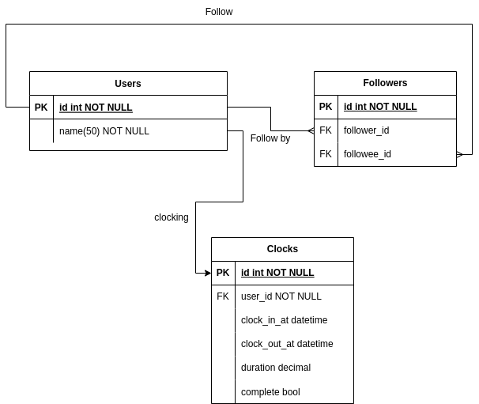

# README

## Database


## Endpoints
1. Login `POST /api/sessions`
   <br>
   body
   <br>
   ```
   { 
     "user": { 
       "name": "Name of the user"
      }
   }
   ```
2. Follow user `PUT /api/users/:user_id/follow`
3. Unfollow user `PUT /api/users/:user_id/unfollow`
4. Clock in function `POST /api/records`
5. Clock out function `PUT /api/records/:record_id`
6. See all friend sleep histories `GET /api/users/histories`

## Authentication
it was designed to be a simple application. We can login using user's name and will returned jwt to authenticate another endpoints.

## Testing
We use native Rails unit testing to cover testing for the app. We can improve it using Rspec in the future.
```
rails test
```